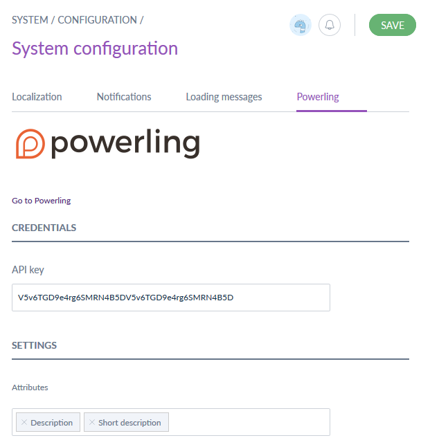
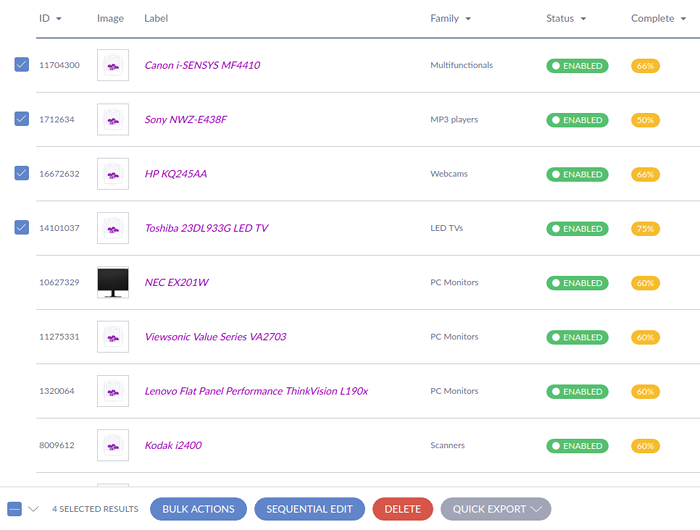
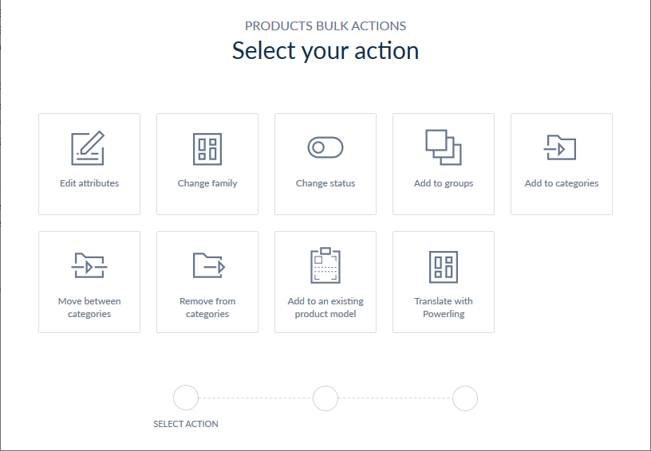
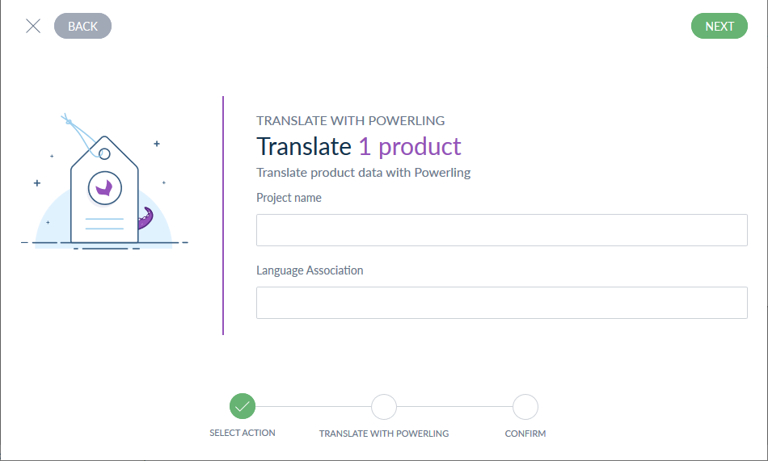
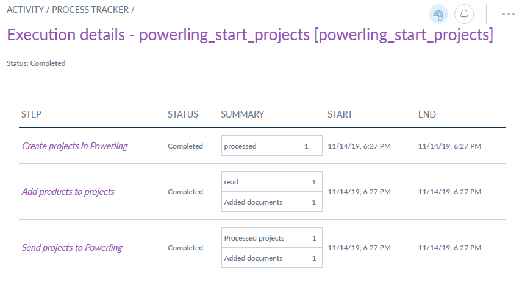

# Powerling extension for Akeneo PIM

[](https://travis-ci.org/powerling-rd/akeneo-extension)

## Description

The Powerling Akeneo extension allows you to easily translate your Akeneo product contents to a large quantity of languages with a simple mass edit process.

## Requirements

In order to start using this extension, first contact our sales team through this form: [https://powerling.com/contact/cms-token](https://powerling.com/contact/cms-token)
Once the modalities of the collaboration settled, you will be provided with an API token

## How it works

The translation request is done by a very simple mass edit process:

- Select your products in the grid and choose the "translate with Powerling" mass edit operation.
- Choose the language association used for this translation project.
- Send your products to Powerling in just one click
- Your products will be pushed back in the PIM as soon as the translation is complete

## Installation

First step is to require the sources:
```
composer require powerling/akeneo-extension 3.0
```

Register your bundle in the `AppKernel::registerProjectBundles`:

```
new \Pim\Bundle\PowerlingBundle\PimPowerlingBundle(),
```

Then we need to add a new mass edit batch job:

```
bin/console akeneo:batch:create-job 'Powerling Connector' 'powerling_start_projects' "mass_edit" 'powerling_start_projects'
```

Add the new routes used by the extension to the global router. Add the following lines at the end of `app/config/routing.yml`:

```
powerling:
    resource: "@PimPowerlingBundle/Resources/config/routing.yml"
```

Update the database schema and regenerate your cache and assets:

```
rm -rf var/cache/* web/bundles/* web/js/* web/css/*
bin/console doctrine:schema:update --force --env=prod 
bin/console p:i:a --env=prod
bin/console a:i --env=prod
yarn run webpack
find ./ -type d -exec chmod 755 {} \;
find ./ -type f -exec chmod 644 {} \;
```

Finally, you must set a `cron` to retrieve the translated contents from Powerling:
```
0 * * * * /home/akeno/pim/bin/console pim:powerling:retrieve-translations >> /tmp/powerling.log
```

This command checks for translated content once every hour. We do not recommend to check more often than every hour to not overload the Powerling servers.

### Parameters

You can configure your Powerling plugin in the dedicated screen: `System >> Configuration >> Powerling`



In this screen you will be able to set:

- you API credentials : `API key`
- the attributes you want to translate

### Sandbox

When you install the extension, it aims at Powerling's sandbox environment.
In order to make it aim at the production environment, add the following line to your parameters.yml file:

```
powerling.base_uri.app: 'https://api.powerling-tp.com'
```

## Screenshots









This extension is based on the Akeneo TextMaster extension developped by Jean-Marie Leroux and Jessy Jurkowski
